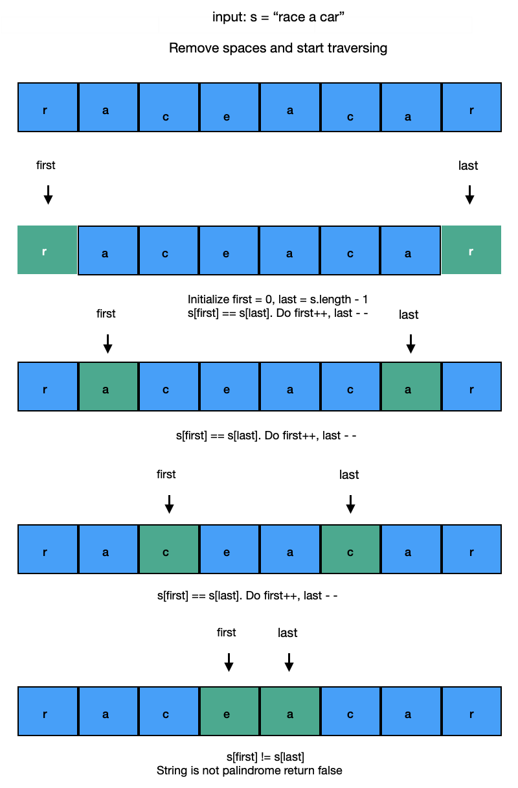

# Valid Palindrome Solution

We can solve this problem with different approaches. <br/> If we can use built-in function we can apply these approaches:
  - Compare with Reverse -> Java's reverse() and Character.isLetterOrDigit() methods.
  - Two Pointers ->  Java's Character.isLetterOrDigit() method.

Otherwise, we can use ASCII table or Regex. 
- With ASCII table we can filter string. Remember these: **'A' -65 , 'a' - 97 ,'Z' - 90 , 'z' -122   48 - 57 >  '0' - '9''**. Then we can apply twi pointers.

I will apply two pointers approaches.
### What is the Two Pointers Technique?
The Two Pointers technique involves using two pointers to navigate through a data structure like an array or a string. These pointers move according to specific conditions and are useful for tasks such as searching, comparison, or manipulation of elements. This technique optimizes solutions by reducing time complexity, often from O(n²) to O(n), making it efficient for array or string manipulation problems.

#### Step 1: Function Definition

Firstly, we define a function named isPalindrome. This function will take a string and check if it is a palindrome or not. The return type of the function will be boolean.

```
public boolean isPalindrome(String s) {
// The content of the function will be explained in the following steps
}
```

#### Step 2: Examining the Content with Two Pointers Technique

Using the Two Pointers technique, we will create two pointers between the beginning and end of the string. These pointers will move towards each other, checking if the characters match.
```
for (int first = 0, last = s.length() - 1; first < last; first++, last--) {
// The steps to be processed will be explained in the following steps
}
```

#### Step 3: Checking Characters

We initialize two pointers and examine the characters from the beginning and end of the string. As long as the characters match, we move the pointers towards each other. However, if the characters are not letters or digits, we skip them.
```
while (first < last && !Character.isLetterOrDigit(s.charAt(first))) {
first++;
}
while (first < last && !Character.isLetterOrDigit(s.charAt(last))) {
last--;
}
```

#### Step 4: Character Comparison

We check if the characters pointed by the two pointers match. We convert both characters to lowercase and check if they match.
```
if (Character.toLowerCase(s.charAt(first)) != Character.toLowerCase(s.charAt(last)))
return false;
```

#### Step 5: Returning the Result

If the characters match and the entire string is examined, then the string is a palindrome, so we return `true`. Otherwise, we return `false`.



#### Complexity Analysis

* Time complexity: `O(n)` in length `n` of the string. We traverse over each character at most once, until the two pointers meet in the middle, or when we break and return early.
* Space complexity: `O(1)`. No extra space is required, at all.
